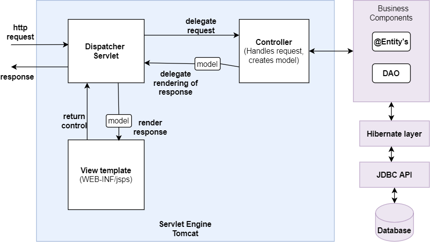
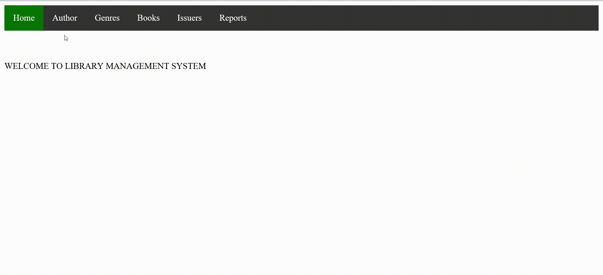
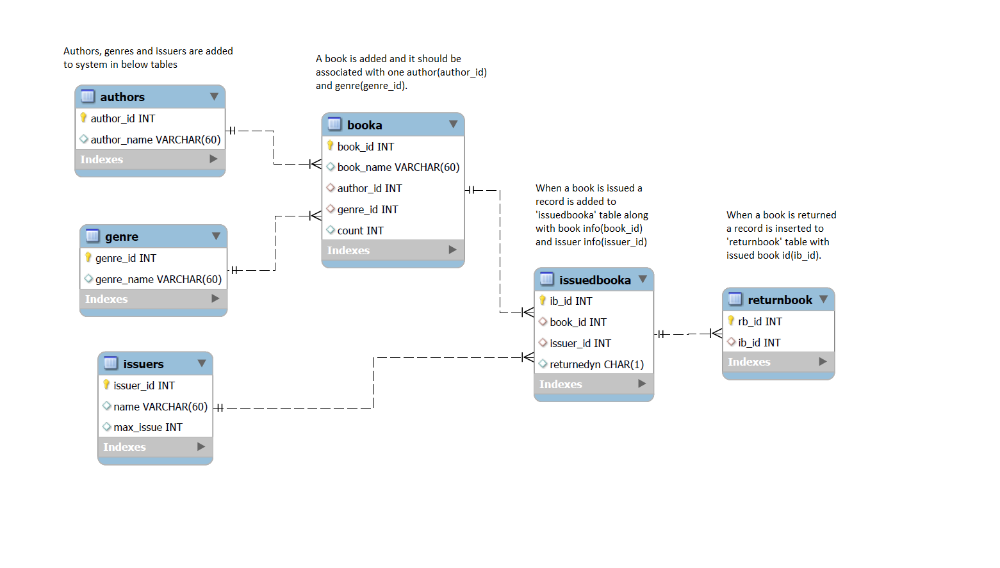
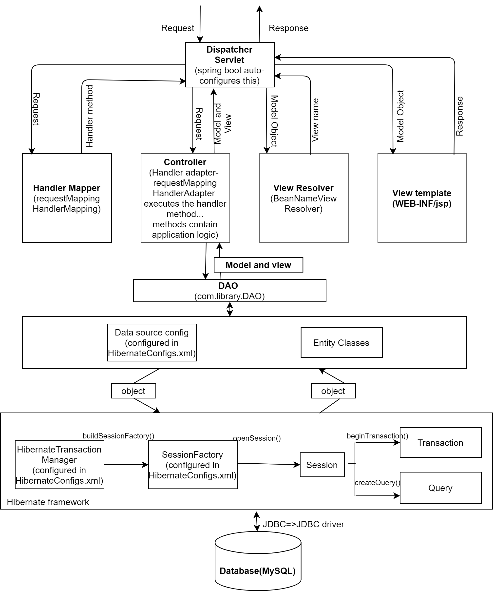

# Description: #
The objective of the project is to build a library management system for library administrataion employees.
The application allows the end-user to add genres, authors and books. It allows the end-user to search the book by genre, author or book. It allows the user to issue a book and keep track of number of books left.

# High-Level Architechture: #
Below image shows the high-level architechture of the application. in-detail architechture and how the application work behind the scenes is discussed in later sections.

# End-user workflow: #
A glimpse of end-user workflow is hown in the below video. 

#### Administration employee operations include: ####
* Add, modify, delete a genre.
* Add, modify, delete an author.
* Add, modify, delete a new book along with number of books available.
* Search books by genre, author or book names.
* Add a book issuer along with a limit on number of books a issuer can issue.
* Modify or delete a book issuer.
* Issue a book and keep track of number of books available.
* Return a book and keep track of number of books available.

# Entity Relationship diagram #
ER diagram for the application is shown below.

# Application Architechture: #
This is a spring boot application integrated with hibernate. The picture below shows the architechture/flow diagram of the application.

#### How application works behind the scenes: ####
* The project is a maven spring boot project created through the spring initializer web service. All required dependencies are added to pom.xml
* On the start-up of the application spring starts a WebApplicationContext by looking up auto-config initializers and annotations. 
* All essential components like DispatcherServlet,requestMappingHandlerMapping,requestMappingHandlerAdapter etc. are auto-configured and set up at this stage.
* The application uses Hibernate integration. All tables in the database are mapped to persistent classes in package com.library.beans using annotations like @Entity, @Table etc.
* All view templates(jsp files) are maintained in WEB-INF/jsp folder.

#### Workflow: ####
* Spring starts and auto-configures an embedded web server i.e Tomcat. 
* war packaging is used to set up the application. SpringBootServletInitializer runs SpringApplication from a WAR archive deployed on tomcat. This class binds Servlet, Filter and ServletContextInitializer beans from the application context to the server.
* Any http request is received by the dispatcher servlet.
* Dispatcher servlet then dispatches the task of selecting appropriate handler method to requestMappingHandlerMapping, which then returns the appropriate handler method. This is done through @RequestMapping annotation in the controller class in com.library.controller.
* Dispatcher servlet then dispatches the task of executing the selected method to requestMappingHandlerAdapter.
* @ModelAttribute is used as a method argument in most methods.it indicates the argument should be retrieved from the model. When not present, it should be first instantiated and then added to the model and once present in the model, the arguments fields should be populated from all request parameters that have matching names.
* This method contains application logic and connects to Database if required.
* Whenever any database operation is required to be performed in the application logic, the DAO class is instantiated and appropriate method that deals with the DB operation  is called from the DAO object with appropriate method arguments as discussed above. 
* HibernateTransactionManager bean and sessionFactory bean are configured in hibernateconfigs.xml. 
* Local session factory bean creates a hibernate session factory which is injected to hibernate DAO classes(classes with @Repository annotation).A hibernate session is opened through the session factory and DB operations are performed using methods beginTransaction() and createQuery(). Queries are written in hibernate query language. 
* Hibernate interacts with MySQL Database through JDBC, performs the persistence logic and returns a persistent object(Model).
* Finally after the handler method executes the application logic it returns a ModelAndView. View name is returned and Model contains the data returned.
* Then, the dispatcher servlet dispatches the task of resolving the ModelAndView to View Resolver. The ViewResolver provides a mapping between view names and actual views. The data returned in the model is set to the actual views appropriately and displayed at the client.

# Guide to run the application: #
* Clone the project from git to your local system.

#### Database: ####
* Install and set up MySQL server by following this link https://dev.mysql.com/downloads/installer/. 
* Grant all permissions to your user by running the following command on mysql command line. Replace ${username} with your 		mysql username. 
GRANT SELECT, INSERT, UPDATE, DELETE ON *.* TO ${username}@localhost; 
* Go to cloned project folder, open file dbsetupscript.sql and run all commands on mysql command line.
* Configure database details in HibernateConfigs.xml file in path Cloned project location\src\main\resources\HibernateConfigs.xml.
* Under bean datasource, change properties url, username, password with your database details.

#### Build: ####
* Make sure maven is installed, if not follow instructions from here http://maven.apache.org/install.html and complete the installation.
* Open cmd prompt in the cloned project folder and run the command 'mvn clean install'.
* Make sure build is successful, and target folder is generated.

#### Server: ####
* Download and install tomcat on your machine. 
* Go to path cloned project folder/tomcat/library.xml.
* copy file library.xml and paste it in path tomcat installation directory/conf/Catalina(if required create this folder)/loalhost(if required create this folder).
* Edit library.xml, replace ${Cloned project location} with the path of your cloned project location and save.
* Start tomcat and make sure tomcat is running.
* In any browser load the URL: http://localhost:${http port number}/library/
